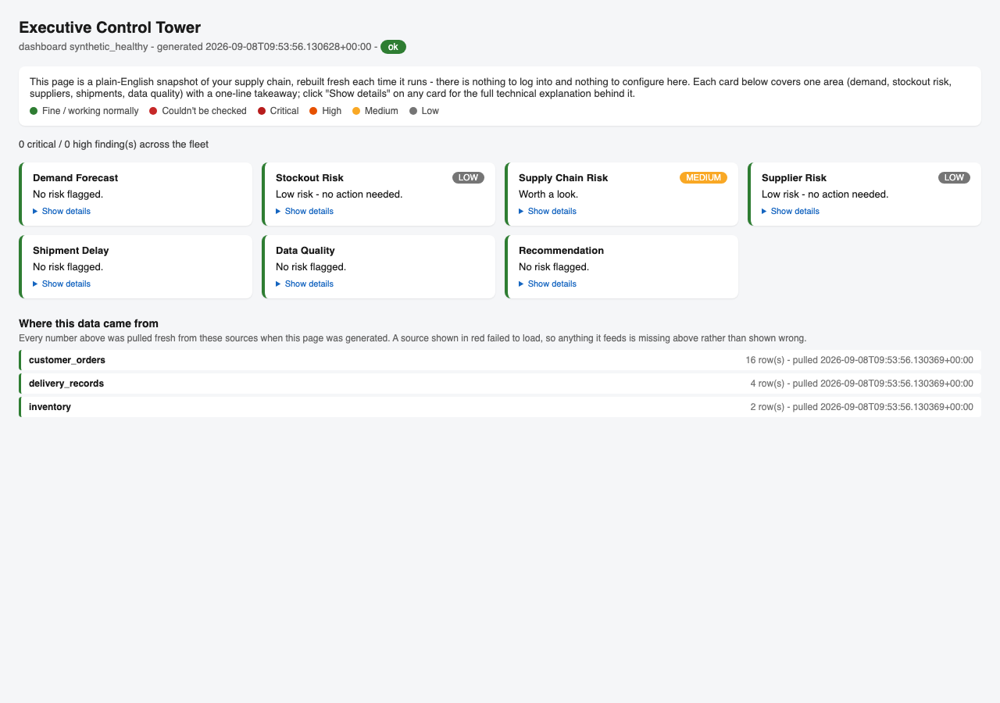
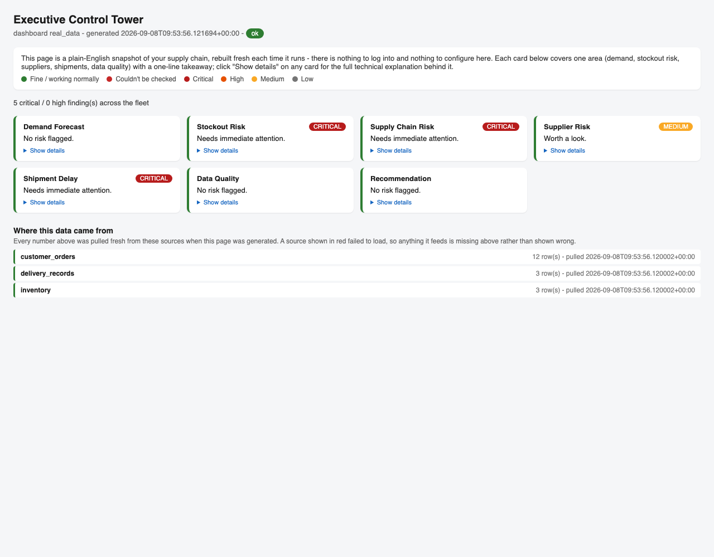
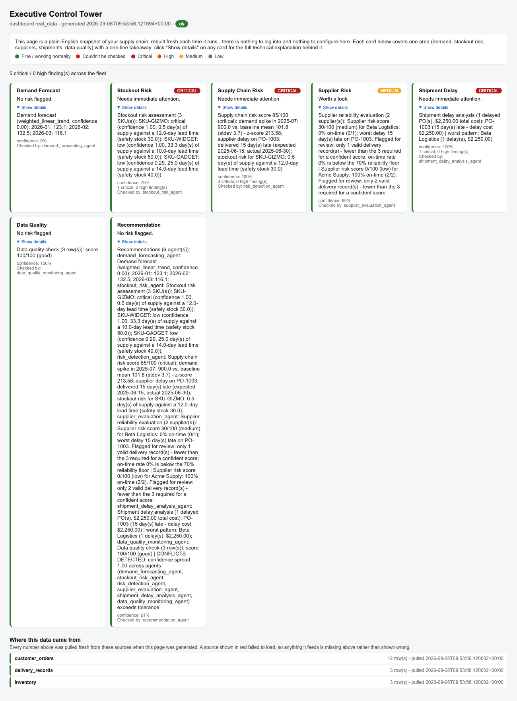
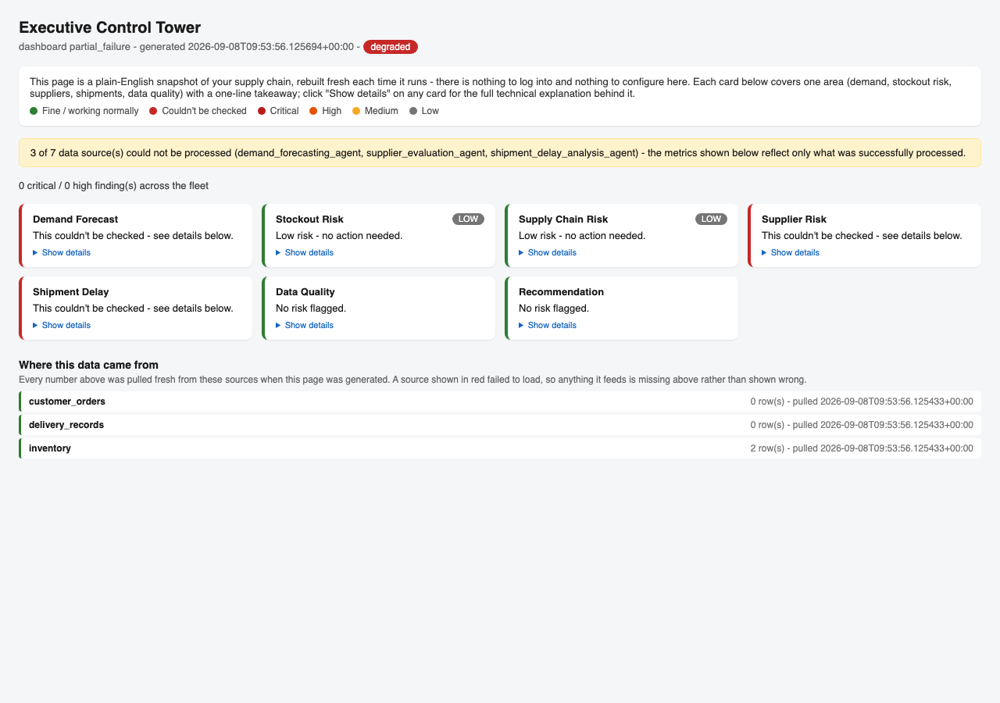

# Your Dashboard, Explained (No Assumed Knowledge)

This is a walkthrough of the **Executive Control Tower** — the one-page dashboard
that shows the health of your supply chain. It assumes you have never seen it
before. Real screenshots are included below, taken from this repo's own demo data.

---

## 1. What is this, in one sentence?

It's a single web page (a plain `.html` file) that reads your supply chain data,
runs it through a set of checks (demand, stockout risk, suppliers, shipments,
data quality), and shows you the results as a set of simple cards — one card
per check.

There is no server running in the background and nothing "live" — you generate
the page, it's a snapshot of that moment, and you open it in any browser.

## 2. How do I open it?

From the repo root, with Python installed:

```
python3 -m dashboard.run_sample_dashboard
```

This writes three files into the `dashboard/` folder:

- `control_tower_real_data.html` — built from whatever real data source you've pointed it at
- `control_tower_partial_failure.html` — a built-in demo of what it looks like when some data fails to load
- `control_tower_synthetic_healthy.html` — a built-in demo of what a "clean bill of health" looks like

Double-click any of those `.html` files (or open them with your browser's
File → Open) to view them. That's the entire workflow — run one command,
open a file.

## 3. Does it have a login?

**No.** There is no username, password, or account of any kind. Anyone who can
open the generated `.html` file can see everything on it — the same way anyone
who can open a PDF you emailed them can read it. Treat the generated file the
way you'd treat any other exported report: don't put it somewhere public if the
underlying numbers are sensitive.

This is a deliberate, simple design for a single generated report — not a gap
that's "still being built." If this ever needs to become a shared, always-on
website that multiple people log into separately, that would be a new,
larger piece of work (a real web server, accounts, sessions) — worth calling
out explicitly if you want it, but it is not what exists today.

## 4. Does it work differently for different "owners"? Do I need roles?

**No, and no.** There is currently no concept of "users" or "owners" built into
this dashboard at all — not "everyone sees the same thing," but literally
nothing in the code distinguishes one viewer from another. Whoever opens the
file sees the exact same page as everyone else who opens that same file.

You would only need roles (e.g., "warehouse manager sees inventory only,"
"executive sees everything") if you wanted **different people to see
different slices of the same data**, or if this became a hosted, multi-company
product where Company A must never see Company B's numbers. Neither of those
exists today — right now it's one report, generated from one dataset, viewable
by whoever has the file. If you want role-based views later, say so and it
gets scoped as its own piece of work — it is not something to bolt on quietly.

## 5. What does each card mean?

Every card follows the exact same shape:

1. **A name** — which part of your supply chain it's checking (Demand Forecast,
   Stockout Risk, Supplier Risk, Shipment Delay, Data Quality, Recommendation).
2. **A colored badge**, only shown if something needs your eyes: **Critical**
   (dark red), **High** (orange), **Medium** (yellow), or **Low** (gray). No
   badge at all means nothing worth flagging came up.
3. **One plain sentence** — the takeaway, before any jargon. One of:
   "Needs immediate attention.", "Needs attention soon.", "Worth a look.",
   "Low risk - no action needed.", "No risk flagged.", or "This couldn't be
   checked - see details below."
4. **A "Show details" link** — click it to expand the full technical
   explanation (the exact numbers, dates, and reasoning) underneath the plain
   sentence. Collapsed by default so the page reads clean at a glance; the
   full detail never disappears, it's just tucked away until you want it.

A card's left-hand color stripe means something different from the badge:
**green** = this check ran successfully (regardless of what it found — a
critical finding can still be "successfully checked"); **red** = this check
could not run at all (the data it needed wasn't available), which is a
different problem from a bad finding.

## 6. Screenshot walkthrough

### A calm day — nothing needs attention

Every card is green, no badges, "No risk flagged" or "Low risk" everywhere.
This is what it looks like when demand is steady, suppliers are reliable, and
nothing is running low.



### A day that needs attention

Same page, different data. Notice the page structure hasn't changed at all —
only the colors, badges, and sentences have, because the underlying numbers
say something is wrong (a stockout risk, a late delivery, a demand spike).



### Clicking "Show details"

Here every card's details are expanded, showing the full technical
explanation each check produced — exact SKUs, dates, dollar amounts, and
confidence scores. This is the same information a data analyst on your team
would want; it's just hidden by default so a first-time viewer isn't
overwhelmed by it.



### When a data source fails

If one of your data sources can't be read (bad credentials, network issue,
empty table), the affected cards turn red and say so plainly, and a yellow
banner at the top names exactly which sources failed. Everything that *could*
still be checked keeps working — one broken data source never blanks out the
whole page.



## 7. How does it decide what data to use? ("the logic")

Every time you run the dashboard, it pulls three tables from a PostgreSQL
database using three fixed queries:

| Table | What it holds |
|---|---|
| `customer_orders` | Order history (date, SKU, quantity) — feeds demand forecasting |
| `delivery_records` | Purchase orders and their expected vs. actual delivery dates — feeds supplier and shipment checks |
| `inventory` | Current stock levels, safety stock, demand rate, lead time per SKU — feeds stockout risk |

Those three queries live in one place: `DATASETS` near the top of
`dashboard/run_sample_dashboard.py`. The dashboard itself has no idea whether
that data is "real" or "test" — it just runs the checks on whatever rows come
back. **Which database it talks to is controlled entirely by four environment
variables**, not by anything inside the dashboard code:

```
SUPPLYMIND_PG_HOST
SUPPLYMIND_PG_PORT       (defaults to 5432 if not set)
SUPPLYMIND_PG_DATABASE
SUPPLYMIND_PG_USER
SUPPLYMIND_PG_PASSWORD
```

If those aren't set, the "real data" pull fails cleanly (see the red-card
example above) rather than crashing.

## 8. "What if I want to run it against a different dataset?"

You have three options, from easiest to most involved:

**Option A — use the built-in local test database (fastest, no setup).**
This repo ships a small, self-contained Postgres you can start with one
command — no Docker, no installation beyond what's already in
`requirements.txt`:

```
eval "$(python3 scripts/local_test_db.py)"
python3 -m dashboard.run_sample_dashboard
```

The first command starts a local database, seeds it with sample data (one
low-stock item, one demand spike, one late delivery), and prints/exports the
four environment variables above into your terminal session. The second
command then reads from it. To change what's *in* that sample data, edit the
seed rows inside `scripts/local_test_db.py`, then run
`python3 scripts/local_test_db.py --reseed`.

**Option B — point it at your own PostgreSQL database.** Set the four
environment variables above to your own database's connection details, then
run the same command:

```
export SUPPLYMIND_PG_HOST=your-db-host
export SUPPLYMIND_PG_DATABASE=your-database-name
export SUPPLYMIND_PG_USER=your-username
export SUPPLYMIND_PG_PASSWORD=your-password
python3 -m dashboard.run_sample_dashboard
```

As long as your database has tables named `customer_orders`, `delivery_records`,
and `inventory` with the columns listed in section 7, this works with zero
code changes.

**Option C — change what's queried, not just where.** If your table or column
names are different, edit the `DATASETS` list at the top of
`dashboard/run_sample_dashboard.py` — it's three lines, each a table name plus
a SQL query. Nothing else in the dashboard needs to change; every downstream
check (`demand_forecasting`, `stockout_risk`, etc.) works from whatever rows
come back, not from where they came from.

There is no "dataset picker" inside the dashboard page itself — switching
datasets is a one-time setup step (which environment variables are set, or
which query is written) before you run the command, not something you click
between on the page. If you want an in-page switcher later (e.g. a dropdown
to flip between two named datasets without re-running anything), that's a
real feature to scope, not something that exists today.

## 9. Quick answers, all in one place

| Question | Answer |
|---|---|
| Login required? | No |
| Different views per person? | No — one page, same for everyone who opens it |
| Roles needed? | No — none exist; would only matter for a future multi-user/multi-company version |
| How do I see it? | `python3 -m dashboard.run_sample_dashboard`, then open the `.html` file it writes |
| How do I use my own data? | Set the four `SUPPLYMIND_PG_*` environment variables, or edit `DATASETS` in `dashboard/run_sample_dashboard.py` |
| What if a data source is down? | Its cards turn red and say so; everything else still works |
| Where's the detail behind a card? | Click "Show details" on that card |
